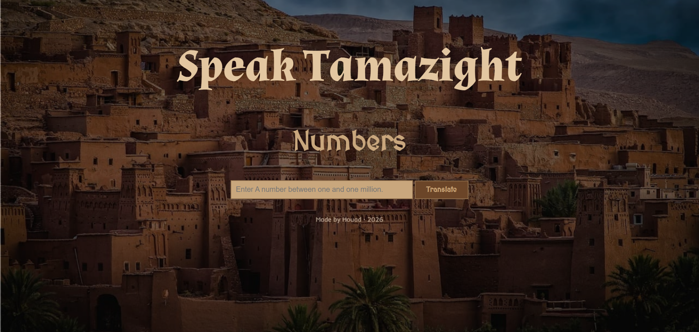

<h1 align="center">Speak Tamazight : Website in HTML & CSS & Python</h1>

A website that translate numbers for a 4,000-year-old language.

## Table of content

- [Demo](#demo)
- [About The Project](#about-the-project)
  - [Home Page](#home-page)
  - [Number Dictionary](#number-dictionary)
  - [Translation](#translation)
  - [Input Validation](#input-validation)
- [Tech Stack](#tech-stack)
- [Author](#author)

## Demo

Link --> [https://speak-tachl7it.up.railway.app/](https://speak-tachl7it.up.railway.app/)

## About The Project

### Home Page

It displays an old Amazigh village in the background, with the title **“Speak Tamazight Numbers”** and a place to input numbers from **0 to 1,000,000**.

### Number Dictionary

The program stores the Tamazight words for numbers and number units in a dictionary called ``nums``.

For example:

- 0 → amya
- 1 → yan
- 2 → sin
- 3 → krad
- 10 → mraw
- 20 → si mraw
- 100 → timidi
- 1000 → ifd
- 1,000,000 → akndid

It also uses special values such as +100 and +1000 to construct larger numbers.

### Translation

The translate() function receives the number entered by the user and breaks it down into its different parts.

It determines whether the number is:

A unit
A number between 10 and 99
A number between 100 and 999
A number in the thousands
A number in the ten-thousands
A number in the hundred-thousands
One million

Different functions are used to handle these cases:

``first_digit()``       :handles single-digit numbers.
``teen()``              :handles numbers from 10 to 99.
``hundred()``           :handles hundreds.
``thounsand()``         :handles the thousands section.
``hundred_thousands()`` :handles hundred-thousand numbers.
``translate()``         :combines everything together.

The program separates the digits mathematically using powers of 10 before constructing the final Tachl7it translation.

### Input Validation

The website accepts a number through an HTML form.

The program checks that:

The input isn't empty.
The input is a whole number.
The number isn't negative.
The number doesn't exceed 1,000,000.

If the input is invalid, an error message is displayed instead of attempting to translate it.

## Tech Stack

- HTML & CSS
- Python & Flask

## Tech Stack
No AI used to make this project. It just guided me to link between Python and Html

## Author

Me: [xtrawalo](https://github.com/xtrawalo)
